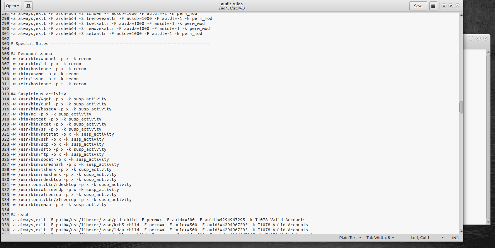
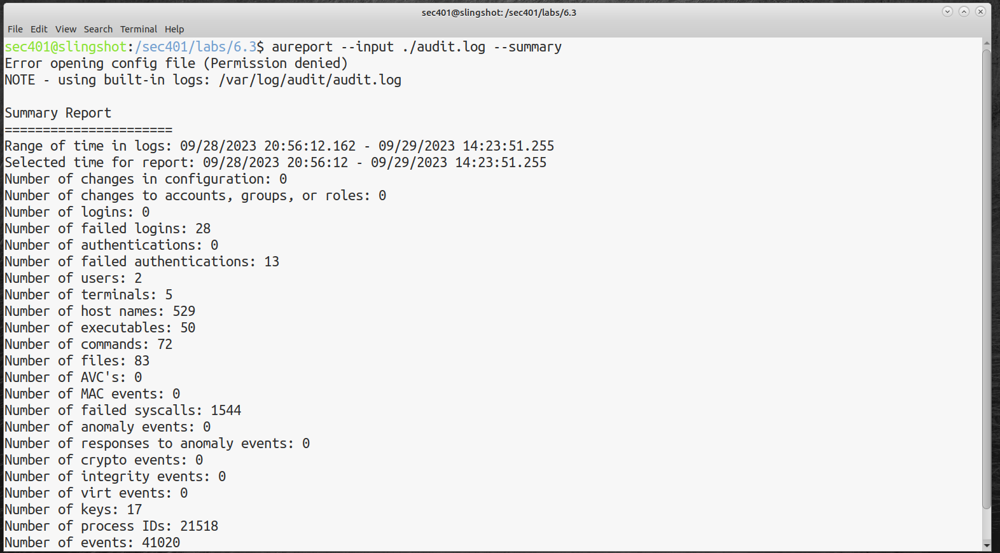
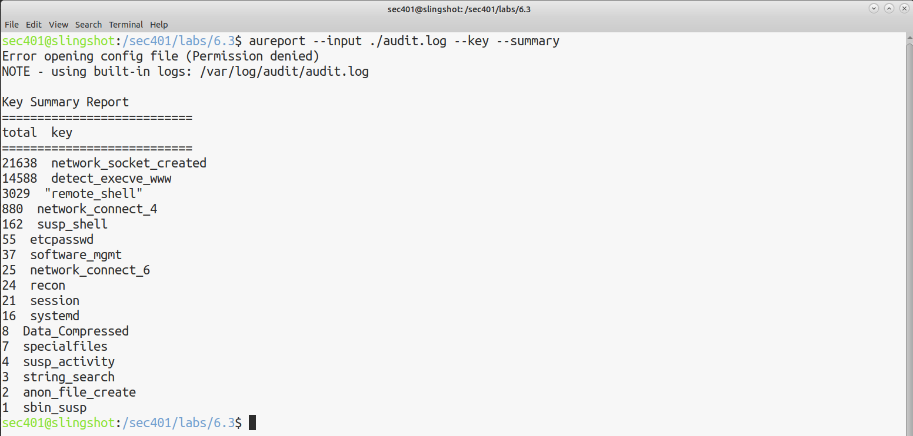
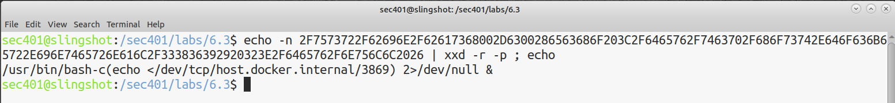
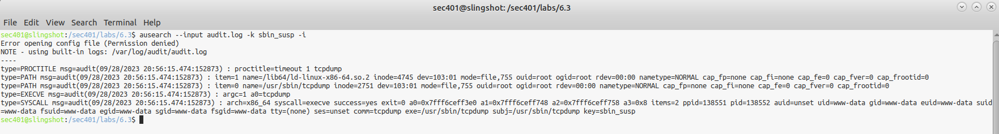
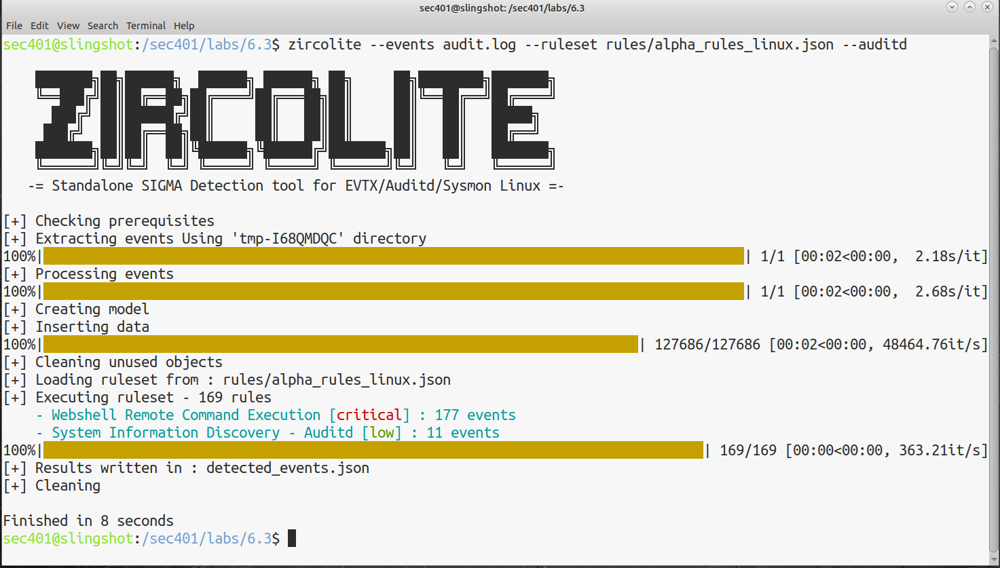
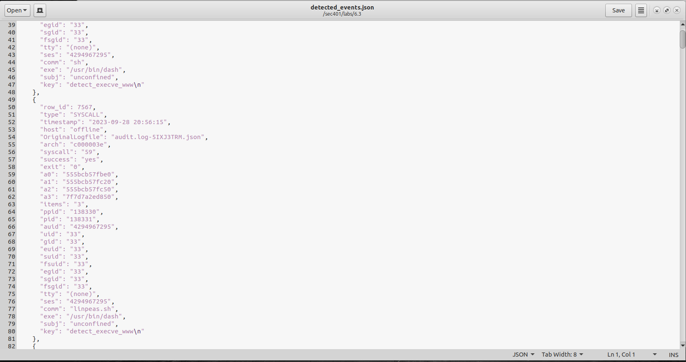

# Lab-6.3-Linux-Logging-and-Auditing

## Overview:

This lab walks though a full Linux audit in an effort of supporting the investigation: An auditd rules file that watches suspicious binaries, aureport/ausearch for querying audit.log, decoding a hex-encoded bash reverse shell, and running Zircolite with a SIGMA ruleset to identify 177 remote command execution events from the audit log. 

## 1: The Auditd Rules File

I opened the audit.rules file with gedit. It’s Florian Roth’s best practice auditd configuration file, based on gov.uk auditd, CentOS 7 hardening, and linux-audit.com tuning guides

## 2: Reviewing the Rules

Core audit patterns: 

-w <path> -p x -k <key> watches binaries for execution. The key “recon” watches cover whoami, id, hostname, uname, /etc/issue.
susp_activity covers wget, curl, base64, nc, netcat, ncat, ss, netstat, ssh, scp, sftp, ftp, socat, wireshark, tshark, rdesktop, xfreerdp, nmap.

## 3: aureport

The aureport utility provides a high-level summary overview of the events in the captured audit log (audit.log). I found 41020 events, 28 failed logins, 13 failed authentications, 72 commands, 50 executables, 83 files, 1544 failed syscalls, 17 keys, 21518 process IDs, from Sept 28, 2023 20:56:12 – Sept 29, 2023 14:23:51. 

## 4: Events per Key Value

Running aureport again, this time focusing on the key-based breakdown of which audit rules fired the most. This broke down 41,000 events into 17 specific areas. 

## 5: Decoding a hex-encoded reverse shell

One of the audit events contained a hex-encoded command. I used the xxd command to decode. The decoded command shows an attempt to open a TCP connection to host.docker.internal on port 3869. 

## 6: ausearch

Using the ausearch utility, I pulled every event with the key sbin_susp: suspicious execution of administrative/networking tools. The results show 5 different records of this one event. I found the uid=33 (www-data) invoking /usr/sbin/tcpdump – the webserver user spawning a packet sniffer. The -i parameter converts hex-encoded output and Unix timestamps to human-readable formats. 

## 7: Zircolite: SIGMA Rules for Detection

Using Zircolite, I ran 169 SIGMA detection rules against the audit.log. Completing in 8 seconds, it had two matches: 177 critical events for Webshell Remote Command Execution and 11 low events for System Information Discovery. 

## 8: Reviewing detected_events.json

The detections from Zircolite were written to detected_events.json. Inside I found a command that executed “linpeas.sh” – a privilege escalation script from PEASS-ng. 

